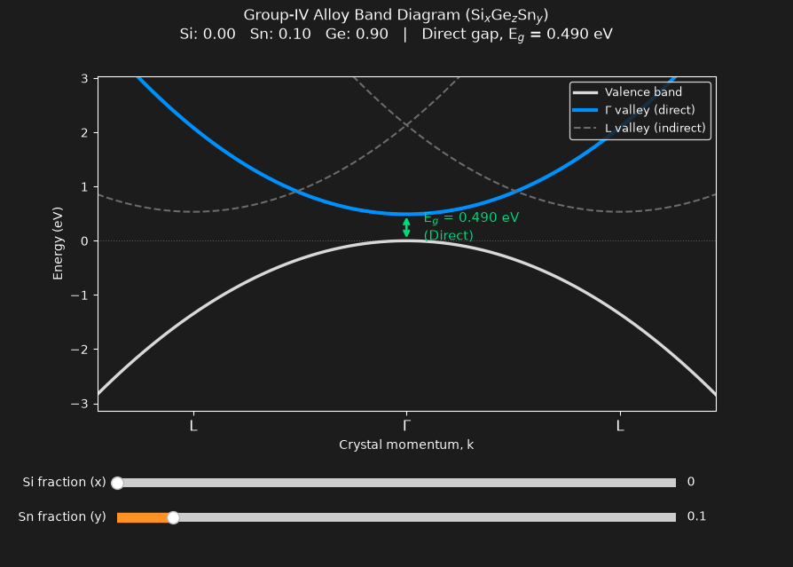

# groupIV-bandstructure-model

A computational physics tool designed to model the electronic band structure, direct–indirect conduction valley crossovers, and pseudomorphic strain dynamics in ternary Silicon-Germanium-Tin (SiₓGe₁₋ₓ₋ᵧSnᵧ) group-IV semiconductor alloys.



## Overview
This project provides a predictive model and interactive visualization environment for investigating band structure engineering in group-IV semiconductors. It evaluates composition-dependent bandgaps, bowing shifts, and biaxial strain corrections relevant to epitaxy and optical device design (e.g., mid-infrared lasers and photodetectors).

## Key Features
- **Nonlinear Band Structure:** Evaluates Γ (direct) and L (indirect) conduction valleys using composition-dependent quadratic Vegard deviations and bowing parameters.
- **Pseudomorphic Strain Model:** Calculates in-plane lattice mismatch strain (ε_xx), Poisson out-of-plane expansion (ε_zz), and hydrostatic energy shifts via deformation potentials (a_c) for epitaxial growth on substrates like Ge or Si.
- **Interactive Band Structure UI:** Real-time Matplotlib interface rendering the E vs. k dispersion relation with live Si and Sn composition sliders.
- **Experimental Validation:** Comprehensive test suite (`pytest`) benchmarking theoretical crossover points and demonstrated laser alloy compositions from literature (8.8% to 15% Sn).

## Physical Validation Benchmarks
The solver is verified against experimental data from published group-IV photonics literature:
- **Pure Ge Baseline:** Indirect bandgap of ~0.664 eV.
- **Unstrained Crossover:** Accurately reproduces the direct-gap transition near ~8.8–9.0% Sn.
- **Laser Compositions:** Matches room-temperature direct gaps for optically pumped (11%, 12.6% Sn) and electrically injected diode laser alloys (15% Sn).

## Installation & Usage

### 1. Setup Environment
```bash
git clone https://github.com/syler1212/groupIV-bandstructure-model.git
cd groupIV-bandstructure-model
pip install -r requirements.txt
